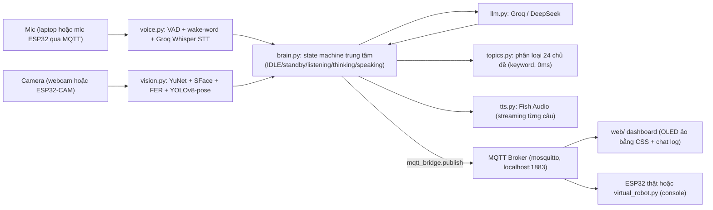

# AI.md — Tóm tắt phần AI/Backend (`Panda-Robotics-Client-/`)

> Tổng hợp bởi Claude sau khi đọc code trong `Panda-Robotics-Client-/` (phần bạn AI trong nhóm làm). Mục đích: để Khoa (firmware) hiểu đủ phần AI để tích hợp đúng, không cần đọc lại toàn bộ ~5200 dòng code. Bỏ qua các file vá lỗi/debug một lần (`patch_*.py`, `fix_*.py`, `test_*.py`, `tools/`, `start.bat`/`stop.bat`) vì không phải kiến trúc chính thức.

## 1. Tổng quan

`Panda-Robotics-Client-/` là bộ **não AI + dashboard web** của robot Panda, chạy trên máy tính/VPS (không chạy trên ESP32). Đây là bản đầy đủ, tham vọng hơn nhiều so với mô tả "thu hẹp phạm vi: tiếng Anh một chiều" trong `PROJECT.md` — xem mục 6 "Lưu ý quan trọng" bên dưới.

Tính năng chính (theo README gốc của thư mục):
- Wake-word "Panda" (tiếng Việt/Anh), STT qua Groq Whisper, LLM trả lời (Groq/DeepSeek), TTS qua Fish Audio.
- Nhận diện khuôn mặt chủ nhân + cảm xúc + tư thế (OpenCV YuNet/SFace/FER + YOLOv8-pose).
- Phân loại 24 chủ đề câu hỏi (time/weather/math/emotion/...) → icon riêng trên OLED.
- Mô phỏng biểu cảm khuôn mặt kiểu robot **Vector (Anki)**: 11 cảm xúc + 4 trạng thái AI (questioning/hearing/thinking/speaking) + 25 hành vi idle tự chủ.
- Kiến trúc tách rời qua MQTT: não (Python) ↔ dashboard (web) ↔ robot (ESP32) không phụ thuộc nhau — **robot thật chỉ là "thin client"**, mọi tính toán AI nặng chạy trên máy tính/cloud.

## 2. Kiến trúc pipeline



## 3. Cấu trúc thư mục (đã lọc file rác/debug)

```
Panda-Robotics-Client-/
├── config/
│   ├── settings.py          # MỌI hằng số: MQTT topics, model, ngưỡng VAD, wake-word list...
│   └── secrets.example.py   # mẫu API key (secrets.py thật bị gitignore)
├── server/
│   ├── brain.py       (788 dòng) # state machine trung tâm, điều phối toàn bộ pipeline
│   ├── voice.py        (866 dòng) # VAD streaming + wake-word 3 lớp + Groq Whisper STT
│   ├── llm.py           (365 dòng) # gọi Groq/DeepSeek, stream câu trả lời
│   ├── tts.py           (476 dòng) # Fish Audio TTS streaming
│   ├── vision.py        (218 dòng) # face/emotion/pose detection (OpenCV + YOLOv8)
│   ├── topics.py         (86 dòng) # phân loại 24 chủ đề bằng keyword
│   ├── wakeword.py      (123 dòng) # Porcupine on-device wake-word (tùy chọn) + fallback Whisper
│   ├── mqtt_bridge.py     (29 dòng) # wrapper publish() MQTT, dùng chung cho mọi module
│   └── virtual_robot.py   (79 dòng) # robot ảo CHỈ IN RA CONSOLE (subscribe panda/cmd/#) — để test brain không cần chip lẫn OLED ảo
├── web/
│   ├── server.js         # Express + Socket.IO, cầu nối MQTT ↔ trình duyệt (broker mqtt://localhost:1883)
│   └── public/
│       ├── index.html, style.css
│       └── app.js (575 dòng) # dashboard: OLED ảo (CSS class-based, KHÔNG phải canvas/pixel), chat log, push-to-talk mic
└── firmware/panda_firmware/
    └── panda_firmware.ino (215 dòng) # ⭐ firmware ESP32 THẬT của nhóm AI — xem mục 5
```

## 4. MQTT — hợp đồng giao tiếp (đọc từ `config/settings.py` + `server/brain.py`)

| Topic | Hướng | Payload | Ghi chú |
|---|---|---|---|
| `panda/cmd/move` | brain → robot | `"forward"\|"back"\|"left"\|"right"\|"stop"` | điều khiển động cơ |
| `panda/cmd/arm` | brain → robot | `"wave"\|"up"\|"down"` | robot hiện KHÔNG có tay — firmware chỉ log, không lỗi |
| `panda/cmd/buzz` | brain → robot | `"on"\|"off"` | |
| `panda/cmd/face` | brain → robot + dashboard | tên biểu cảm, vd `"happy"` | xem đủ danh sách ở mục 5 |
| `panda/cmd/text` | brain → robot | chuỗi text tự do | hiện OLED chữ tĩnh |
| `panda/status` | robot → brain | `{"dist": <cm>, "btn": 0|1}` | sonar + nút, publish ~2Hz |
| `panda/ai/state` | brain → dashboard | `"IDLE"\|...` | state máy trạng thái chính |
| `panda/ai/thinking`, `panda/ai/response`, `panda/ai/topic` | brain → dashboard | text | hiện chat log + caption chủ đề |
| `panda/ai/clip`, `panda/ai/mic_live`, `panda/ai/voice_audio` | mic trình duyệt/robot → brain | audio (base64/PCM) | đường mic thay thế khi không có mic cục bộ |
| `panda/camera` | camera → vision | frame ảnh | |

**Broker**: `config/settings.py` đặt `MQTT_BROKER = "localhost"` — nhóm AI giả định **tự host Mosquitto** (đúng khoản "Não cloud (giờ G)" trong BOM), khác với demo học tập của Khoa hiện đang dùng broker công cộng `broker.hivemq.com`. Topic namespace cũng khác hẳn: `panda/cmd/*`, `panda/ai/*`, `panda/status` (chuẩn thật) so với `panda/demo/khoa/*` (chỉ dùng riêng cho demo học — theo đúng quy ước "không đụng namespace người khác" trong `CLAUDE.md`) — **không bị đụng độ, nhưng khi tích hợp thật sẽ cần chuyển firmware của Khoa sang đúng namespace `panda/cmd/*`/`panda/status`.**

## 5. Biểu cảm khuôn mặt — nguồn tham chiếu chính cho phần nhúng

Nhóm AI đã làm biểu cảm ở **2 nơi khác nhau**, ngoại hình không giống hệt nhau:

1. **`web/public/app.js`** (dashboard trình duyệt) — OLED ảo dựng bằng **CSS class** (không phải vẽ pixel), danh sách đầy đủ:
   - 11 cảm xúc (`ALL_EMOTIONS`): `neutral, happy, sad, surprised, angry, love, wink, sleepy, dizzy, cool, cute`
   - 4 trạng thái AI (`ALL_AI_MODES`): `questioning, hearing, ai-thinking, speaking`
   - 25 hành vi idle tự chủ (`IDLE_BEHAVIORS`, vd `idle-look-left/right/up`, ...) — Panda tự "liếc mắt" khi rảnh, không nhại cảm xúc người dùng (mặc định `EMOTION_MIRROR = False` trong settings.py).
   - Là nguồn gốc của **bảng màu neon theo cảm xúc** và các hiệu ứng `@keyframes` mà firmware sau này mô phỏng lại.

2. **`firmware/panda_firmware/`** — ⭐ **đây mới là code dùng được trực tiếp**. Đã được nhóm AI viết lại (cập nhật 08/09/2026), giờ tách thành nhiều file:
   - `Config.h` — bảng chân GPIO + **bảng màu RGB565** khớp dashboard web (`COLOR_CYAN 0x067F`, `COLOR_PINK 0xF9B0`, `COLOR_BG 0x0823`...) + hằng số kích thước/tốc độ khung hình.
   - `FaceRenderer.h` — bộ vẽ khuôn mặt cho **màn TFT ILI9341 320×240 màu** (không còn là OLED đơn sắc): 15 biểu cảm `neutral/happy/sad/angry/surprised/love/wink/sleepy/cool/cute/dizzy/questioning/hearing/ai-thinking/speaking` + 5 hành vi idle (`idle-look-left/right/up`, `idle-curious`, `idle-squint`). Vẽ vào `GFXcanvas16` 170×100 trong RAM rồi bắn 1 lần bằng `drawRGBBitmap()`, chạy 60fps, có hệ thống nháy mắt riêng.
   - `firmware/oled_face_test/` — sketch test riêng chỉ để xem khuôn mặt, dùng lại chính `FaceRenderer.h` (tên thư mục còn chữ "oled" từ thời cũ, nhưng bên trong đã là ILI9341).
   - Cách chọn biểu cảm: nhận lệnh qua topic `panda/cmd/face` (MQTT thật) HOẶC gõ tay `face happy` / `demo` qua Serial Monitor (chế độ mô phỏng Wokwi, không cần MQTT).

**Đã tích hợp vào `firmware-demo/` của Khoa (Tuần 4, 08/09/2026)**: sau khi nhóm đổi BOM sang màn ILI9341, `firmware-demo/src/display.*` đã được **viết lại hoàn toàn** theo cùng kiến trúc (canvas trong RAM + blit 1 lần), giữ nguyên **tên biểu cảm** và **bảng màu RGB565** để tương thích khi ghép MQTT thật. Khác biệt có chủ ý so với bản của nhóm AI: canvas lớn hơn (240×130 thay vì 170×100, vì demo của Khoa không phải chừa RAM cho camera), thêm quầng sáng neon 2 lớp quanh mắt, và một số hiệu ứng riêng (giọt nước mắt khi `sad`, chữ "z" bay khi `sleepy`, vệt sáng quét kính khi `cool`, hạt lấp lánh khi `cute`). Xem `WEEKLY_LOGIC.md` mục Tuần 4 để biết chi tiết.

> **Lưu ý về bảng chân**: `firmware-demo/src/pins.h` của Khoa đã cố tình đặt chân SPI **trùng khớp 1:1** với `Config.h` (CS=5, RST=4, DC=2, MOSI=23, SCK=18, MISO=19) để 2 firmware nạp chung một mạch thật được. Đừng đổi số chân ở một bên mà không báo bên kia.

## 6. Firmware mẫu của nhóm AI vs. `firmware-demo/` của Khoa — khác biệt cần lưu ý

| | `firmware/panda_firmware/` (nhóm AI) | `firmware-demo/src/` (Khoa) |
|---|---|---|
| Cấu trúc | `.ino` + các file `.h` (`Config.h`, `FaceRenderer.h`, `RobotMotor.h`), Arduino IDE style | Tách `.h`/`.cpp` theo module, PlatformIO |
| Phạm vi | Gộp cả HEAD (màn TFT) + BODY (motor, HC-SR04, buzzer, nút) trong 1 sketch | Chỉ màn TFT + 2 nút + WiFi/MQTT + module học I2S |
| Khuôn mặt | Canvas 170×100, 60fps, 15 biểu cảm + 5 idle | Canvas 240×130, 33fps, 15 biểu cảm + quầng sáng neon + hiệu ứng phụ riêng |
| Kết nối | Mặc định chạy Serial-command (không cần MQTT); `#define USE_MQTT` để bật WiFi+MQTT thật | Luôn dùng WiFi+MQTT (broker công cộng để demo) |
| MQTT reconnect | `if (!mqtt.connected()) mqtt.connect(...)` — kiểm tra mỗi vòng loop, không có cơ chế chờ giữa các lần thử | Đã làm "bền hơn" ở Tuần 3: chỉ thử lại mỗi 5s bằng `millis()`, không chặn `loop()` (xem `WEEKLY_LOGIC.md`) |

**⚠️ Trùng chân GPIO cần lưu ý khi ghép code thật:** file `.ino` của nhóm AI dùng `PWMA=25, AIN1=26, PWMB=32, BIN1=33, POT(sim)=34` cho motor/cảm biến (thuộc BODY), trong khi `firmware-demo/src/pins.h` của Khoa đang dùng đúng **những GPIO số hiệu này** (25/26 cho 2 nút, 32/33/34 cho I2S) trên **cùng 1 board demo**. Đây không phải lỗi — theo đúng kiến trúc BOM thật, 2 bộ chân này thuộc **2 board ESP32 khác nhau** (HEAD dùng I2S, BODY dùng motor) nên khi tách board thật (Tuần 9) sẽ không đụng nhau. Chỉ cần lưu ý: **không được gộp 2 sketch này chạy chung 1 board** mà không đổi số chân.

## 7. Model/asset cần tải riêng (không có trong repo)

`face_detection_yunet_2023mar.onnx`, `face_recognition_sface_2021dec.onnx`, `emotion-ferplus-8.onnx`, `res10_300x300_ssd_iter_140000.caffemodel`, `yolov8n(-pose).pt` — tất cả bị gitignore (nặng/bản quyền), phải tự tải theo README gốc trong `Panda-Robotics-Client-/README.md` nếu muốn chạy server AI. **Không liên quan trực tiếp tới phần việc firmware của Khoa** — chỉ cần biết để hiểu vì sao thư mục `server/` thiếu vài file `.onnx`/`.pt`/`.xml` khi mở lên.

## 8. Lưu ý quan trọng — đối chiếu với "Quyết định thu hẹp phạm vi" trong `PROJECT.md`

`PROJECT.md` ghi nhận nhóm đã **thu hẹp phạm vi xuống dạy tiếng Anh một chiều, không hội thoại hai chiều** (lý do: hạn chế thời gian/kỹ năng ML). Nhưng code thực tế trong `Panda-Robotics-Client-/` cho thấy bạn AI đã build **một trợ lý hội thoại tiếng Việt đầy đủ**: wake-word tiếng Việt, LLM trả lời tự do 24 chủ đề (không chỉ chấm từ vựng), nhận diện khuôn mặt/cảm xúc/tư thế — tức là **phạm vi thực tế đã rộng hơn nhiều** so với quyết định thu hẹp đã ghi.

Đây chỉ là **quan sát khách quan từ code**, Claude không tự sửa lại phần "Quyết định thu hẹp phạm vi" trong `PROJECT.md` vì đây là quyết định của cả nhóm, không phải điều Khoa (hay Claude) có thể tự quyết một mình. **Khoa nên trao đổi lại với nhóm** xem có nên cập nhật lại phần "Scope note" trong `README.md`/`CLAUDE.md`/`PROJECT.md` cho khớp thực tế hay không, để tránh ghi sai trong báo cáo cuối kỳ.

**Cập nhật (21/09/2026):** nhóm đã quyết định thêm **tiếng Nhật** vào phạm vi dạy, song song với tiếng Anh (chi tiết ở `PROJECT.md` mục "Thêm lại tiếng Nhật vào phạm vi") — vẫn giữ mô hình một chiều robot → trẻ, không quay lại hội thoại Việt↔Nhật hai chiều như đề xuất gốc. Phần này chủ yếu ảnh hưởng tới firmware (font Kana trên màn hình) và dữ liệu từ vựng có gắn nhãn ngôn ngữ; **chưa rõ code AI (`brain.py`, `voice.py`, `llm.py`, `tts.py`) đã có sẵn phần xử lý tiếng Nhật hay chưa** — cần Khoa xác nhận lại với bạn phụ trách AI trước khi giả định STT/LLM/TTS trong `Panda-Robotics-Client-/` đã hỗ trợ song ngữ Anh/Nhật, vì tài liệu này chỉ tóm tắt code tại thời điểm đọc, chưa được cập nhật lại theo quyết định mở rộng phạm vi lần này.

## 9. Việc cần phối hợp giữa Khoa (firmware) và bạn AI

- **Namespace MQTT**: khi ghép thật, đổi `firmware-demo/` từ `panda/demo/khoa/*` sang đúng chuẩn `panda/cmd/*` (nhận lệnh) + `panda/status` (gửi cảm biến) mà `brain.py`/`web/server.js` đang subscribe sẵn.
- **Broker**: đổi từ `broker.hivemq.com` (demo công cộng) sang broker tự host mà nhóm AI dùng (`localhost:1883`, hoặc VPS thật khi có).
- **Biểu cảm khuôn mặt**: dùng chung 1 bộ tên biểu cảm (`neutral/happy/sad/angry/surprised/sleepy/wink/love/cool/cute/dizzy/questioning/hearing/thinking/speaking`) **và** bảng màu RGB565 giữa firmware của Khoa và payload `panda/cmd/face` mà brain.py publish — đã port ở Tuần 3 và viết lại cho màn ILI9341 ở Tuần 4, xem `WEEKLY_LOGIC.md`. Lưu ý một khác biệt nhỏ về tên: bản của nhóm AI dùng `ai-thinking`, firmware của Khoa nhận cả `thinking` lẫn `ai-thinking` để khỏi lệch.
- **Chân GPIO**: thống nhất lại bảng chân giữa 2 board HEAD/BODY thật trước khi ai đó nạp cả 2 sketch lên cùng 1 board test nhanh (xem mục 6).
